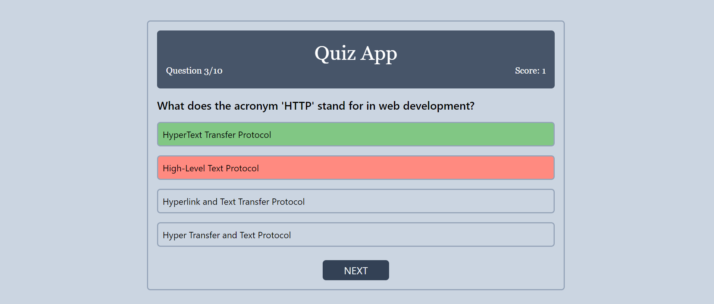

# Quiz App

Welcome to the Quiz App! This simple quiz application is built using Tailwind CSS for styling and JavaScript for functionality.

## Live Demo
Check out the live demo [here](https://quiz--app.vercel.app/).

## Getting Started

To run the quiz app locally, follow these steps:

1. Clone the repository to your local machine:

    ```bash
    git clone https://github.com/AnuragKhokhar/quiz-app.git
    ```

2. Open the project directory:

    ```bash
    cd quiz-app
    ```

3. Open the `index.html` file in your web browser.

## Features

- Multiple-choice questions with one correct answer.
- Immediate feedback on correct and incorrect answers.
- Dynamic styling using Tailwind CSS.

## Technologies Used

- HTML
- JavaScript
- Tailwind CSS

## How to Play

1. Open the quiz app in your web browser.
2. Answer each question by clicking on the provided options.
3. See immediate feedback:
   - Correct answers turn the background color green.
   - Incorrect answers turn the background color red.

## Screenshots



## Project Structure

```plaintext
quiz-app/
│
├── index.html
├── styles.css
├── script.js
├── images/
│   └── screenshot.png
└── tailwind.config.js
